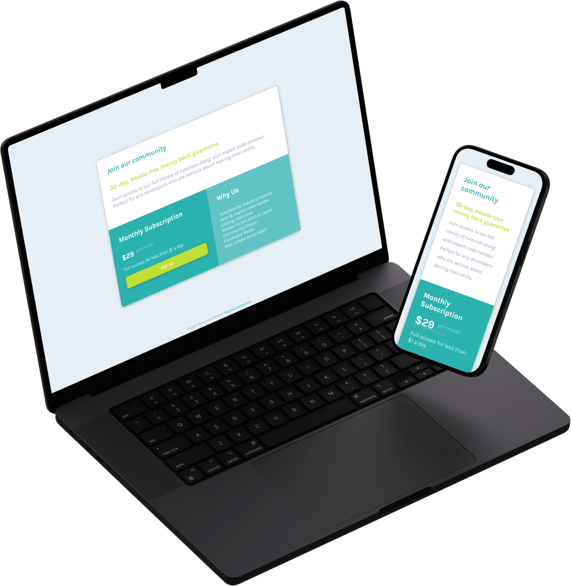

# Single Price Grid

 Projeto do Frotend Mentor

 ## Ferramentas Utilizadas
 - HTML
 - CSS
 - Figma

## Funcionalidades
- Ver o layout ideal dependendo do tamanho da tela.
- Ver estados de foco para elementos interativos.

## Como Executar
Para executar o aplicativo, basta abrir o arquivo index.html em um navegador da web compatível.

[Ou clique no aqui e será direcionado ao site ativo.]()

## Personalização
Esse projeto pode ser personalizado para diversos fins.

## Autor
Este projeto foi desenvolvido por Tatyane Gonçalves.